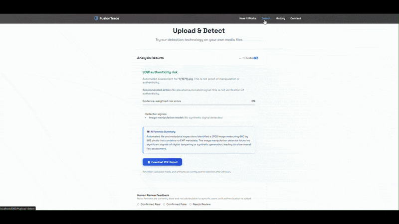
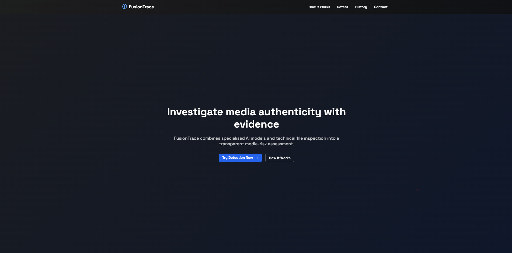
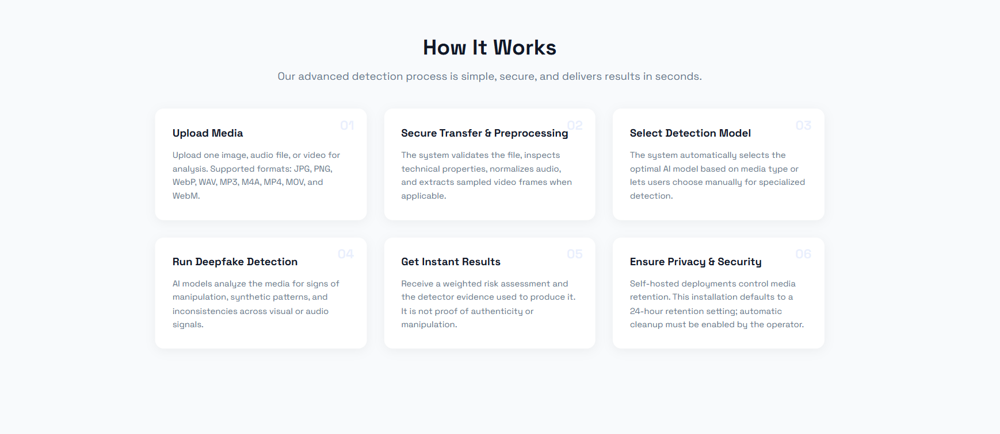
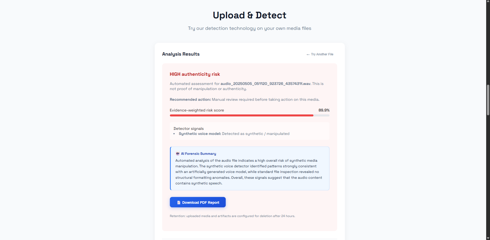
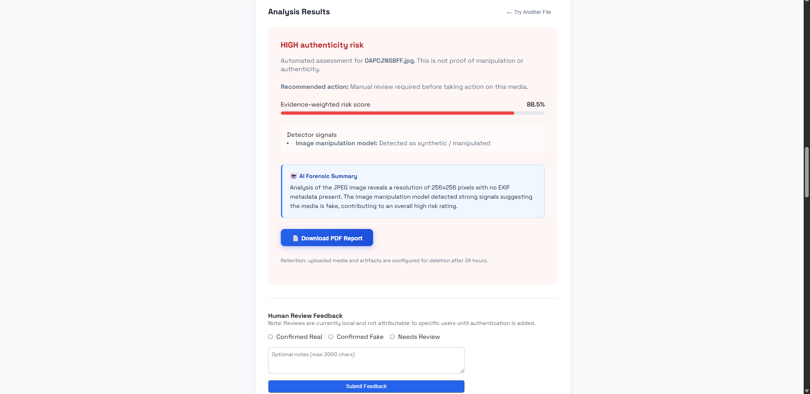
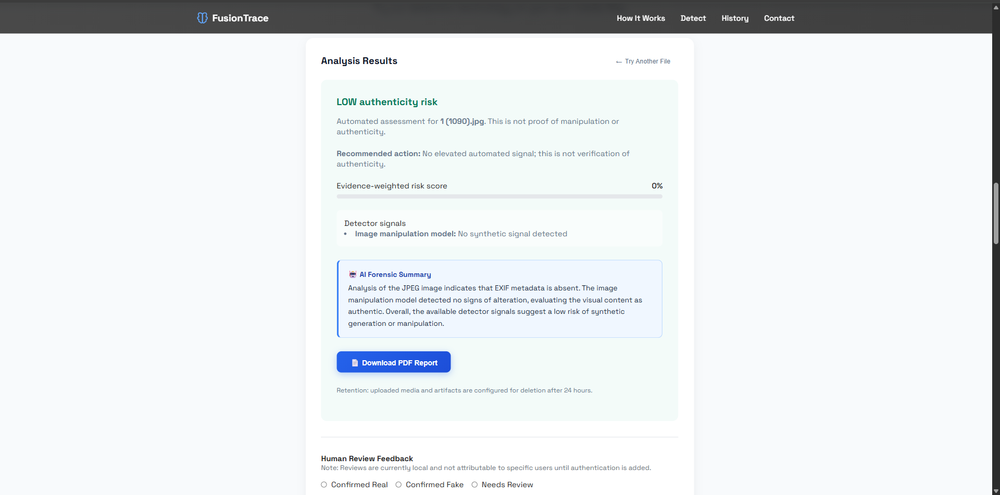
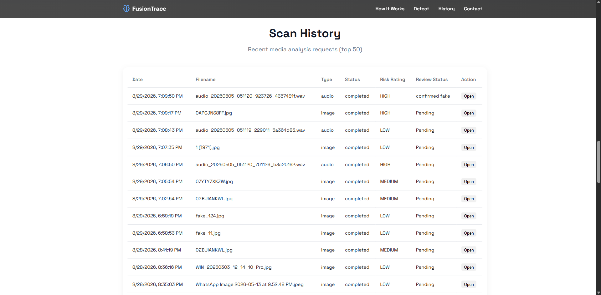
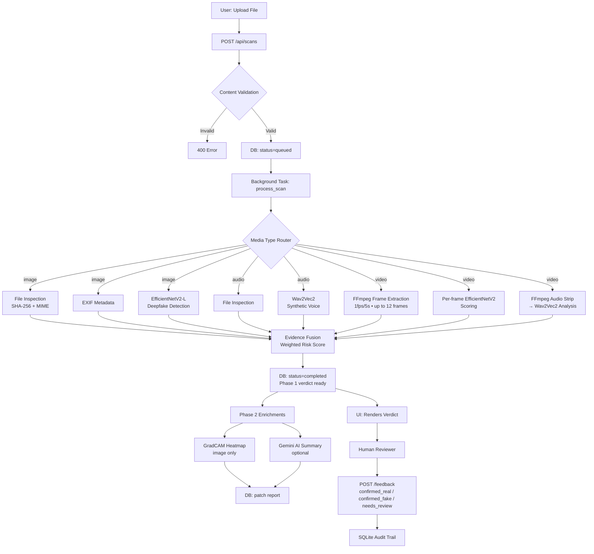

<div align="center">

# 🔍 FusionTrace

### Enterprise Media Authenticity Assessment

*Investigate media authenticity with evidence — not just a score.*

[](https://www.python.org/)
[](https://fastapi.tiangolo.com/)
[](https://pytorch.org/)
[](LICENSE)
[]()

[](resources/images/FusionTrace_Demo.gif)
[](resources/docs/1.pdf)
[](https://github.com/MuthuVarshith/FusionTrace)

---



</div>

---

## 🚨 The Problem

The rapid advancement of generative AI has made it effortless to produce hyper-realistic synthetic media — deepfake videos, AI-cloned voices, and generated imagery. This is no longer a theoretical risk:

- **Financial fraud**: Synthetic CEO voice calls have been used to authorize wire transfers worth millions.
- **Legal evidence tampering**: AI-generated images and audio are being presented in disputes.
- **Disinformation at scale**: Fake media spreads faster than corrections, eroding public trust.

Existing tools fail in one or more of three critical ways:

| Problem | Common Tool Behavior | FusionTrace Approach |
|---|---|---|
| **Privacy** | Upload your file to a third-party cloud server | 100% local ML inference — your file never leaves your machine |
| **Explainability** | Return a single percentage score with no reasoning | Multi-signal evidence report + GradCAM heatmap + AI forensic summary |
| **Coverage** | Handle only one media type (images *or* audio) | Unified pipeline for images, audio, and video |

---

## 💡 The FusionTrace Philosophy

FusionTrace was built around three non-negotiable design decisions:

### 1. Evidence Fusion — A Jury, Not a Single Judge
Every scan runs **multiple independent detectors** in parallel: file integrity inspection, EXIF metadata analysis, a deep learning image model, and a voice synthesis model. The final verdict is a **weighted risk score** fused from all signals. A single model being wrong doesn't doom the result — the other detectors act as a check.

### 2. Zero-Upload Privacy
The deep learning models (EfficientNetV2 and Wav2Vec2) run entirely on your hardware. Your media files are never transmitted anywhere. The *only* external network call is an optional, tiny JSON payload of numerical scores sent to the Gemini API to generate the text summary. Turn off the `GEMINI_API_KEY` and the entire system runs 100% offline.

### 3. Explainability Over Accuracy Theater
A black-box "89% fake" score is useless in a professional context. FusionTrace generates:
- **GradCAM heatmaps**: A pixel-level overlay showing *exactly which regions* of an image triggered the manipulation flag.
- **AI Forensic Summary**: A hedged, plain-language narrative written by an LLM — *"signals suggest..."* not *"this is fake"*.
- **Human-in-the-Loop**: Analysts can log `Confirmed Real`, `Confirmed Fake`, or `Needs Review` — building an auditable feedback trail.

---

## 📸 Screenshots

<table>
  <tr>
    <td align="center"><strong>Landing Page</strong></td>
    <td align="center"><strong>How It Works</strong></td>
  </tr>
  <tr>
    <td></td>
    <td></td>
  </tr>
  <tr>
    <td align="center"><strong>High Risk — Audio Analysis Result</strong></td>
    <td align="center"><strong>High Risk — Image Result + Human Review</strong></td>
  </tr>
  <tr>
    <td></td>
    <td></td>
  </tr>
  <tr>
    <td align="center"><strong>Low Risk — Image Result</strong></td>
    <td align="center"><strong>Scan History Dashboard</strong></td>
  </tr>
  <tr>
    <td></td>
    <td></td>
  </tr>
</table>

---

## ✨ Feature Matrix

| Feature | Description | Powered By |
|---|---|---|
| **Image Deepfake Detection** | Detects synthetic or manipulated imagery using a fine-tuned vision model | EfficientNetV2-L (PyTorch/Timm) |
| **Synthetic Voice Detection** | Identifies AI-generated or cloned speech from audio tracks | Wav2Vec2 (HuggingFace Transformers) |
| **Video Multimodal Analysis** | Samples frames at 1fps/5s (up to 12) + strips and analyzes the audio track separately | FFmpeg + both ML models |
| **GradCAM Heatmap** | Pixel-level attention overlay — shows *where* the model focused | Pure PyTorch hooks + NumPy (no OpenCV) |
| **Evidence Fusion Engine** | Weighted multi-signal risk score with `low` / `medium` / `high` rating | Custom fusion algorithm |
| **AI Forensic Summary** | 2–3 sentence hedged plain-language narrative from detector signals | Google Gemini Flash (optional) |
| **A4 PDF Report Export** | One-page forensic report with scan metadata, risk scores, and heatmap | Jinja2 PDF renderer |
| **Human Audit Trail** | Reviewer labels + free-text notes persisted per scan | SQLite |
| **Async Scan Pipeline** | File accepted in <1ms; ML inference runs as a background task; UI polls for result | FastAPI Background Tasks |
| **Auto File Retention** | Uploads and artifacts auto-deleted after configurable window | Startup + pre-scan cleanup |
| **Content Validation** | Files validated by content (PIL verify, soundfile, FFmpeg probe), not just extension | Server-side security |

---

## 🗺️ Architecture



---

## 🧠 ML Models & Training

### Image Model — EfficientNetV2-L

| Property | Detail |
|---|---|
| **Architecture** | `tf_efficientnetv2_l` via Timm, custom classification head |
| **Training Strategy** | Transfer learning — base frozen, last 30 layers unfrozen |
| **Head** | `Linear(features → 512) → SiLU → BatchNorm → Dropout(0.3) → Linear(512 → 1)` |
| **Output** | Sigmoid probability — ≥ 0.5 = Fake |
| **Validation Accuracy** | **96%** on internal test set |
| **GradCAM** | Hooked on `base_model.blocks[-1]`; pure PyTorch gradients — no OpenCV dependency |

Training notebooks: [`/backend/notebook/image_detection/`](backend/notebook/image_detection/)

### Audio Model — Wav2Vec2

| Property | Detail |
|---|---|
| **Architecture** | `Wav2Vec2ForSequenceClassification` (HuggingFace) |
| **Preprocessing** | Resample to 16kHz → mono → normalize → trim/pad to 4s |
| **Input Formats** | WAV (soundfile), MP3/M4A (pydub + FFmpeg) |
| **Output** | Softmax class probabilities — `Real` (0) or `Fake` (1) |
| **Triage** | Confidence ≥ 90% on Fake → `high-priority` review flag |

Training notebooks: [`/backend/notebook/audio_detection/`](backend/notebook/audio_detection/)

---

## ⚡ Video Pipeline — Deep Dive

Video analysis is uniquely challenging because it combines visual and acoustic signals across time. FusionTrace uses a purpose-built multimodal pipeline:

```
1. FFmpeg Frame Extraction
   └─ Sample 1 frame every 5 seconds, up to 12 frames max
   └─ Saves as individual JPEGs in a per-scan artifact directory

2. Per-Frame Scoring
   └─ Each JPEG frame is independently scored by EfficientNetV2-L
   └─ Reports: average risk across all frames + peak frame timestamp

3. Audio Track Extraction
   └─ FFmpeg strips the audio to 16kHz mono WAV
   └─ Wav2Vec2 analyzes for synthetic voice patterns

4. Evidence Fusion
   └─ Frame analysis (weight: 0.8) + Audio analysis (weight: 0.9) → final risk score
```

> **Honest limitation**: This pipeline detects per-frame manipulation and synthetic audio. Lip-sync inconsistency detection and full temporal consistency models are not yet implemented (see Roadmap).

---

## 📄 Sample Forensic Reports

View real exported A4 PDF reports generated by FusionTrace:

| Report | Description |
|---|---|
| [📎 Report 1](resources/docs/1.pdf) | High-risk image scan with GradCAM analysis |
| [📎 Report 2](resources/docs/2.pdf) | High-risk audio scan — synthetic voice detected |
| [📎 Report 3](resources/docs/3.pdf) | Low-risk scan — no elevated signals |
| [📎 Report 4](resources/docs/4.pdf) | Medium-risk scan — inconclusive result |
| [📎 Report 5](resources/docs/5.pdf) | Video multimodal scan with frame + audio breakdown |

---

## 💻 Getting Started

FusionTrace requires **at least 2GB of free RAM** to load the ML models.

### Option A — Local (Recommended for Development)

```bash
# 1. Clone the repository
git clone https://github.com/MuthuVarshith/FusionTrace.git
cd FusionTrace/backend

# 2. Create and activate a virtual environment
python -m venv .venv
source .venv/bin/activate        # Windows: .venv\Scripts\activate

# 3. Install dependencies
pip install -r requirements.txt

# 4. Configure environment
cp .env.example .env
# Edit .env and add your GEMINI_API_KEY (optional — scans work without it)

# 5. Download model weights
python scripts/download_models.py

# 6. Run the server
python -m uvicorn app.main:app --host 0.0.0.0 --port 8000
```

Open [http://localhost:8000](http://localhost:8000) in your browser.

---

### Option B — Docker Compose (One Command)

```bash
# 1. Clone and configure
git clone https://github.com/MuthuVarshith/FusionTrace.git
cd FusionTrace
cp backend/.env.example backend/.env

# 2. Start the application
docker compose up --build
```

The app will be available at [http://localhost:8000](http://localhost:8000).
Uploaded files and artifacts are persisted in `./backend/data` via a Docker volume.

---

## ⚙️ Configuration Reference

All settings are controlled via environment variables. Create `backend/.env` from the provided example:

| Variable | Default | Required | Description |
|---|---|---|---|
| `GEMINI_API_KEY` | `""` | No | Google Gemini API key for AI forensic summaries. Scans complete without it — `ai_summary` will be `null`. Get a free key at [aistudio.google.com](https://aistudio.google.com/app/apikey). |
| `FUSIONTRACE_CORS_ORIGINS` | `http://localhost:8000` | Yes | Comma-separated list of allowed browser origins. |
| `FUSIONTRACE_RETENTION_HOURS` | `24` | No | Hours before uploaded files and generated artifacts are automatically deleted. |
| `FUSIONTRACE_MAX_UPLOAD_MB` | `200` | No | Maximum file size in MB for a single upload. |
| `FUSIONTRACE_AUDIO_MODEL_PATH` | `models/audio_model` | No | Absolute path override for the Wav2Vec2 model directory. |
| `FUSIONTRACE_IMAGE_MODEL_PATH` | `models/image_model/EfficientnetV2_model.pth` | No | Absolute path override for the EfficientNetV2 weights file. |
| `FUSIONTRACE_DATA_DIR` | `data` | No | Absolute path override for the uploads and artifacts directory. |

---

## 🔌 REST API Reference

The FastAPI server exposes a clean REST API. Interactive docs are available at `http://localhost:8000/docs`.

| Method | Endpoint | Description |
|---|---|---|
| `GET` | `/` | Serves the main HTML UI |
| `GET` | `/health` | Health check — returns model load status and config |
| `POST` | `/api/scans` | **Submit a scan.** Multipart form: `file` (UploadFile) + `generate_ai_summary` (bool). Returns `scan_id` immediately; processing is async. |
| `GET` | `/api/scans/{scan_id}` | Poll for scan results. Check `status` field: `queued` → `processing` → `completed` / `failed`. |
| `GET` | `/api/scans` | List recent scans (default: last 50). Returns summary rows with risk rating. |
| `POST` | `/api/scans/{scan_id}/feedback` | Submit human reviewer feedback. Body: `{"label": "confirmed_real" \| "confirmed_fake" \| "needs_review", "notes": "..."}` |
| `GET` | `/api/scans/{scan_id}/heatmap` | Fetch the GradCAM heatmap JPEG for an image scan (available after `heatmap_ready: true`). |

**Example — Submit a scan and poll for result:**
```bash
# Submit
SCAN=$(curl -s -X POST http://localhost:8000/api/scans \
  -F "file=@/path/to/image.jpg" \
  -F "generate_ai_summary=true")

SCAN_ID=$(echo $SCAN | python -c "import sys,json; print(json.load(sys.stdin)['id'])")

# Poll until completed
curl http://localhost:8000/api/scans/$SCAN_ID
```

---

## 🔒 Privacy & Security

FusionTrace is designed with a privacy-first architecture:

- **No cloud inference**: EfficientNetV2 and Wav2Vec2 run entirely on your own hardware.
- **Content validation**: Every upload is validated by its actual file contents (PIL `image.verify()`, soundfile header check, FFmpeg probe) — not by trusting the user-controlled filename extension.
- **SHA-256 digest**: Every file is hashed and included in the forensic report for tamper evidence.
- **Configurable retention**: Uploaded files and generated artifacts are automatically purged after the configured window (default: 24 hours) on startup and before each new scan.
- **CORS hardened**: Only explicitly configured origins are permitted to call the API.
- **Gemini summary**: If used, only a small JSON object of numerical scores is sent to the API — never the media file itself.

---

## ⚠️ Known Limitations

Being honest about what the tool can and can't do is part of responsible forensics:

| Limitation | Detail |
|---|---|
| **No lip-sync detection** | Video analysis scores individual frames. Temporal lip-sync and face-swap consistency checks are not yet implemented. |
| **Audio clips capped at 4 seconds** | The Wav2Vec2 model was trained on 4-second clips. Longer audio is trimmed; very short clips may yield low-confidence results. |
| **SQLite only** | The persistence layer uses SQLite. It is not suitable for concurrent multi-instance horizontal scaling. |
| **No GPU on CPU-only hosts** | Inference runs on CPU if CUDA is not available. Expect 5–15s per scan on CPU-only hardware. |
| **Not proof of authenticity** | A low risk score does not verify that media is authentic. The system flags signals, not truth. |

---

## 🗺️ Roadmap

Planned enhancements for future versions:

- [ ] **Temporal video models** — lip-sync consistency and face-swap detection across frames
- [ ] **GradCAM for audio** — spectral attention visualization for voice scans
- [ ] **Batch API** — scan multiple files in a single API call
- [ ] **API key authentication** — multi-user access control
- [ ] **PostgreSQL support** — production-grade persistence for multi-instance deployments
- [ ] **Webhook callbacks** — push notification when a scan completes instead of polling

---

## 📁 Project Structure

```
FusionTrace/
├── backend/
│   ├── app/
│   │   ├── main.py              # FastAPI application, routes, lifespan
│   │   ├── service.py           # Scan lifecycle, evidence fusion, persistence
│   │   ├── image_detection.py   # EfficientNetV2 inference + GradCAM
│   │   ├── audio_detection.py   # Wav2Vec2 inference + audio preprocessing
│   │   ├── ai_summary.py        # Gemini forensic summary generation
│   │   └── config.py            # Settings, paths, env var loading
│   ├── notebook/
│   │   ├── image_detection/     # EfficientNetV2 training notebooks
│   │   └── audio_detection/     # Wav2Vec2 training notebooks
│   ├── scripts/
│   │   ├── download_models.py   # Model weight download utility
│   │   └── evaluate_models.py   # Benchmark evaluation scripts
│   ├── templates/               # Jinja2 HTML + static assets
│   ├── models/                  # Model weights (not tracked in git)
│   ├── data/                    # Uploads + artifacts (not tracked in git)
│   └── requirements.txt
├── resources/
│   ├── images/                  # App screenshots and demo GIF
│   └── docs/                    # Sample exported forensic PDFs
├── Dockerfile                   # Production container
├── docker-compose.yml           # Local Docker deployment
└── README.md
```

---

## 📬 Contact & Support

This project was built and is maintained by **Muthu Varshith**.

If you are interested in discussing the architecture, contributing to the project, or exploring professional opportunities, reach out via the built-in **Contact** form in the application itself.

---

<div align="center">
  <sub>FusionTrace — Evidence-based media authenticity. Built with 🧠 and Python.</sub>
  <br>
  <sub>© 2025 Muthu Varshith. Released under the <a href="LICENSE">MIT License</a>.</sub>
</div>
